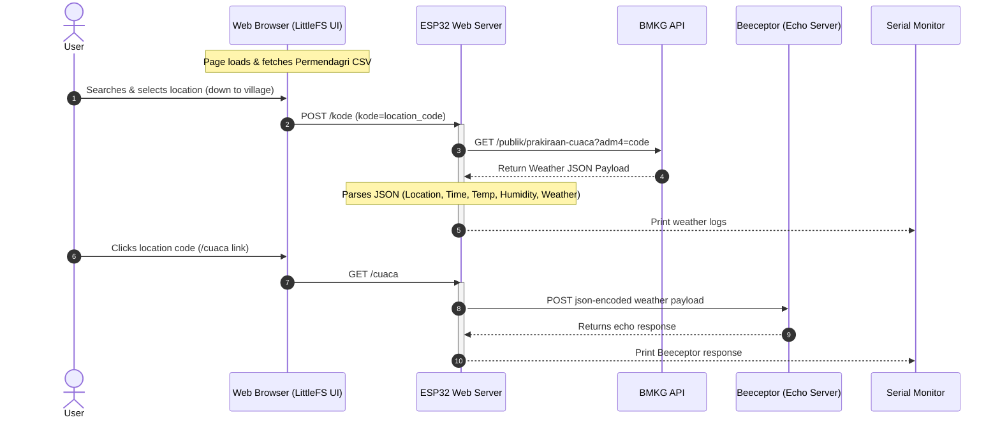

<div style="text-align: center;">

# 🌤️ ESP32 BMKG Weather Tracker & HTTP Client Demo

</div>

<p align="center">
  <a href="#what-it-does">What it does</a> ·
  <a href="#features">Features</a> ·
  <a href="#highlights">Highlights</a> ·
  <a href="#module-market">Module Market</a> ·
  <a href="#feature-catalog">Feature catalog</a> ·
  <a href="#tech-stack">Tech stack</a> ·
  <a href="#build-and-install">Build and install</a> ·
  <a href="#contributing">Contributing</a>
</p>


An interactive IoT application built for the **ESP32** that leverages a local web server, local flash file system storage (**LittleFS**), and external APIs to fetch real-time weather forecasts in Indonesia. It allows users to dynamically search for any Indonesian village, district, city, or province, fetches weather details directly from the **BMKG (Indonesian Agency for Meteorology, Climatology, and Geophysics) API**, and demonstrates outbound data transmission via **HTTP POST** requests to a remote web server.

---

## Features
*   **Local Web Server:** Hosts a web interface on the local network.
*   **BMKG API Integration:** Fetches weather data from BMKG using the OpenWeatherMap API.
*   **HTTP POST:** Sends the weather data to a remote server.
*   **mDNS:** Enables easy access to the web interface using a local hostname (e.g., `esp32-wether.local`).

---
## System Flow & Architecture

The diagram below illustrates how the user, the ESP32, and the external API services interact:



---

## What it does

This project is a hybrid local webserver and API gateway running on an ESP32:
1. **Hosts a Local Portal:** The ESP32 sets up a local web server (port 80) serving an interactive search page stored in `LittleFS`.
2. **Client-Side Administrative Search:** The web page dynamically downloads and parses the official Permendagri administrative area CSV file. Users can search through all provinces, regencies/cities, subdistricts, and villages/kelurahan in Indonesia with high-speed autocomplete functionality.
3. **BMKG Weather Integration:** When a location is selected, the administrative code is sent to the ESP32 via a `POST` request. The ESP32 queries the official BMKG API using the code, parses the returned JSON payload, and outputs real-time parameters (weather status, temperature, humidity, and timestamp) to the Serial Monitor.
4. **Outbound HTTP POST Demonstration:** Clicking the resulting location link triggers the ESP32 to format the retrieved weather details into a JSON payload and transmit it via `HTTP POST` to `https://echo.free.beeceptor.com`, displaying the echo server's confirmation response on the serial connection.

---

## Highlights

* **No Microcontroller Database Overhead:** Heavy administrative area database queries (tens of thousands of Indonesian locations) are done entirely in the client browser using CSV parsing, keeping ESP32 memory consumption minimal.
* **Real-time Government API Data:** Fetches official weather forecasts directly from the government meteorological agency (BMKG) in real-time.
* **Dual Networking Model:** Serves as both an **HTTP Server** (handling local client actions) and an **HTTP Client** (querying external BMKG APIs and posting metadata to mock endpoints).
* **Local Flash Storage:** HTML assets are neatly decoupled from microcontroller source code and served directly from the flash partition using the **LittleFS** file system.

---

## Module Market

To build this project, you will need the following hardware components and software dependencies:

### Hardware Requirements
| Module / Part | Description | Purpose |
| :--- | :--- | :--- |
| **ESP32 Development Board** | NodeMCU ESP32, ESP32-WROOM-32D, or equivalent. | Core microcontroller with Wi-Fi module. |
| **Micro-USB Cable** | USB-A to Micro-USB cable with data support. | Programming and serial communication. |
| **Wi-Fi Network** | Local 2.4GHz Wi-Fi access point (does not support 5GHz). | Internet access for BMKG API and hosting server. |

### 📚 Software & Libraries (IDE)
* **Arduino IDE** (or VS Code with PlatformIO)
* **ESP32 Board Package** (v2.x or v3.x)
* **Arduino_JSON Library** (by Arduino) - For robust JSON parsing.
* **ESP32 WebServer Library** - Pre-installed with ESP32 board package.
* **HTTPClient Library** - Pre-installed with ESP32 board package.
* **LittleFS Library** - File system library built into the ESP32 framework.

---

## Feature Catalog

### 🌐 Web Server & Search Interface (`data/index.html`)
* **Dynamic Autocomplete Suggestion:** Search inputs are matched against Permendagri regions instantly.
* **Category Badges:** Clean visual badges distinguishing villages (`Desa/Kelurahan`), districts (`Kecamatan`), cities/regencies (`Kabupaten/Kota`), and provinces (`Provinsi`).
* **Asynchronous API Posting:** Transmits chosen region codes to the ESP32 using vanilla JavaScript `XMLHttpRequest` without refreshing the page.

### ⚙️ ESP32 Controller firmware (`http-post.ino`)
* **BMKG Parser Function (`APIdanKode`):** Converts raw BMKG JSON responses into string values using `Arduino_JSON`.
* **JSON POST Sender (`PostCuaca`):** Marshals weather details into a standard JSON string:
  ```json
  {
    "Lokasi": "Desa, Kecamatan, Kota, Provinsi",
    "Jam": "YYYY-MM-DD HH:MM:SS",
    "cuaca": "Weather Description",
    "suhu": "Temperature",
    "kelembaban": "Humidity"
  }
  ```
* **Status Endpoint Handler (`HandleRoot`):** Reads the HTML GUI file from the local `LittleFS` storage and streams it to clients.

---

## Tech Stack

* **Firmware Platform:** C++ (Arduino Core)
* **Storage Interface:** LittleFS (Lightweight Flash File System)
* **Frontend Languages:** HTML5, CSS3, JavaScript (ES6, Fetch API, AJAX)
* **APIs & Data Sources:**
  * [BMKG Public Weather API](https://api.bmkg.go.id)
  * [Permendagri Region Database](https://github.com/kodewilayah/permendagri-72-2019)
  * [Beeceptor Mock Server](https://beeceptor.com)

---

## Build and Install

### Step 1: Clone and Set Up Workspace
1. Clone this repository to your local computer.
2. Open the `http-post.ino` sketch in your Arduino IDE.

### Step 2: Configure Wi-Fi Credentials
Before uploading, edit the Wi-Fi credentials in `http-post.ino` to match your local network:
```cpp
// Line 103
WiFi.begin("YOUR_WIFI_SSID", "YOUR_WIFI_PASSWORD");
```

### Step 3: Install ESP32 LittleFS Tool
Since the HTML UI is stored in the `data/` directory, you need to upload it to the ESP32's flash memory.
* Install the arduino-littlefs-upload extension by Earl Philhower
* Download the VSIX file from the [releases](https://github.com/earlephilhower/arduino-littlefs-upload/releases) page.
* Copy the VSIX file to `~/.arduinoIDE/plugins/` on Mac and Linux or `C:\Users\<username>\.arduinoIDE\plugins\` on Windows (you may need to make this directory yourself beforehand).
* Restart the IDE. 

### Step 4: Upload The 'data/' Folder to LittleFS
1. connect your ESP32 board to your PC
2. Open Arduino IDE
3. Select your ESP32 board (e.g., `ESP32 Dev Module`) and select the correct COM/Serial port.
4. Press Ctrl+Shift+P (or Cmd+Shift+P on Mac) to open the Command Palette.
5. Type "Build LittleFS image in sketch directory" and press Enter. This will upload the `data` folder to the ESP32's LittleFS partition.

### Step 4: Compile and Upload
1. Connect your ESP32 board to your PC.
2. Select your ESP32 board (e.g., `ESP32 Dev Module`) and select the correct COM/Serial port.
3. Verify and Compile the sketch.
4. Click **Upload** to write the firmware to the ESP32.

### Step 5: Run and Test
1. Open the Arduino IDE **Serial Monitor** and set the baud rate to **`115200`**.
2. Reset the ESP32 board. It will print its connected IP address and the mDNS name(e.g., `Connected to WiFi. IP address: 192.168.1.15` and `mDNS: http://esp32-wether.local`
).
3. Open your web browser on a device connected to the same Wi-Fi network and navigate to `http://esp32-wether.local`.
4. Search for a location, select it, and watch the Serial Monitor fetch and output the BMKG weather data.
5. Click on the generated link to trigger the POST demo.

---

## Contributing

Contributions make the open-source community an amazing place to learn, inspire, and create. Any contributions you make are **greatly appreciated**.

1. Fork the Project.
2. Create your Feature Branch (`git checkout -b feature/AmazingFeature`).
3. Commit your Changes (`git commit -m 'Add some AmazingFeature'`).
4. Push to the Branch (`git push origin feature/AmazingFeature`).
5. Open a Pull Request.